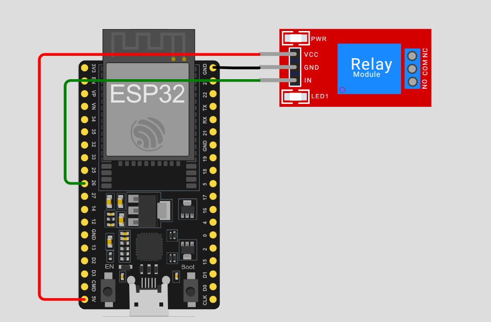
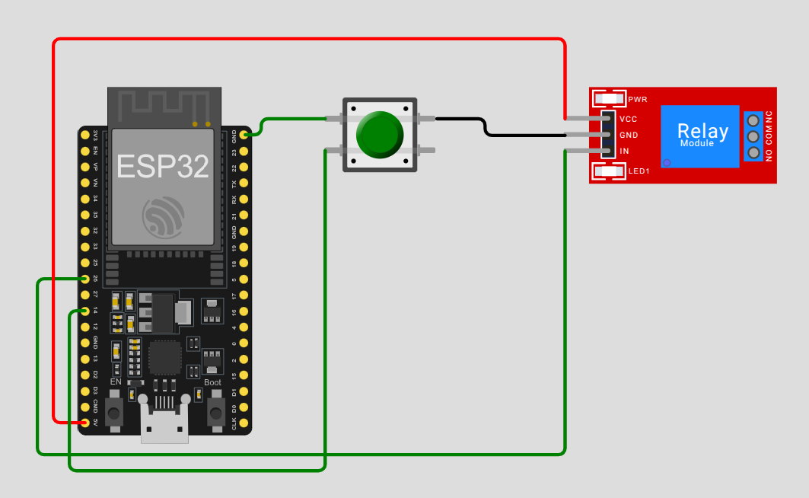
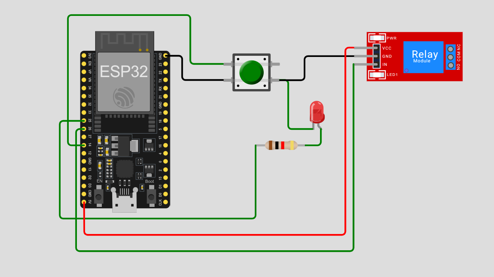

# ESP32 Smart Plug 💡🔌

This project demonstrates the development of a **smart plug** system using the **ESP32** microcontroller and the **ESP-IDF** framework. It is structured in clear development phases, from basic relay control to adding buttons, wireless control via Wi-Fi or Bluetooth and AC handling

> ⚠️ **Disclaimer**: Currently, this project currently does **not** handle high-voltage AC connections. The relay is toggled for **demonstration purposes only** using safe low-voltage logic. Proceed with caution when dealing with real electrical loads.

---

## 🚀 Goal

To build a professional-grade, modular smart plug using **low-level embedded development (ESP-IDF)** more advanced than Arduino while documenting each learning step along the way.

---

## 🧱 Hardware Used

- ESP32-WROOM-32 Dev Board
- SV 2-Channel Relay Module
- F-M DuPont Cables
- Button switch
- LED-Red
- More components to come as project progress

---

## 🗂 Project Structure

```bash
esp32-smart-plug/
├── phases/
│   ├── 01-relay-toggle/        # Toggle relay using GPIO
│   ├── 02-button-toggle/       # Add push-button control
│   ├── 03-led-indicator/       # Add LED feedback for relay state
│   ├── 04-wireless-control/    # (Ongoing) Wi-Fi or Bluetooth toggle via app/web   
|   ├── 05-ac-wiring/           # (Future) Controlled AC output — ⚠️ HIGH VOLTAGE
├── README.md                   # <-- You are here
└── .gitignore
```
## ⚙️ Build & Flash (ESP-IDF)

```bash
cd phases/{phase example 01*}
idf.py set-target esp32
idf.py build
idf.py -p /dev/ttyUSB0 flash monitor
#Press Ctrl + ] to exit the monitor

```
Make sure you’ve installed the ESP-IDF toolchain and environment:
ESP-IDF Setup Guide

## Phase 1: Toggle Relay via GPIO

### 🔌 Wiring

()

### 📺 LIVE Demo 
[](https://youtu.be/I_bsE-cPEDw?feature=shared)

## Phase 2: Control Relay via Button (GPIO Input + GPIO Output)

### 🔌 Wiring 
(())

### 📺 LIVE Demo 
[](https://youtu.be/V0q86zt8WE8?list=PLM2vOwekYYA9Dzuonxj3bN23sQMp2RJj7)

## Phase 3: Control Relay via Button (GPIO Input + GPIO Output) + LED indicator
(())

### 📺 LIVE Demo 
[](https://youtu.be/f3_GK1Ifn0w)

## License

This project is licensed under the MIT License 